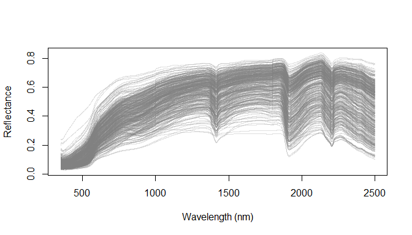
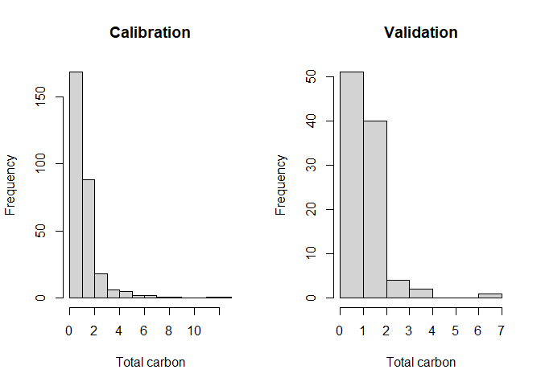
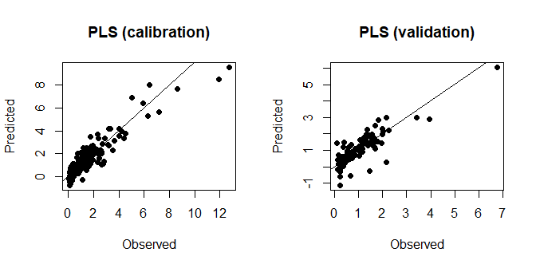

<!-- README.Rmd is generated to README.md for GitHub. Edit README.Rmd, then run: rmarkdown::render("README.Rmd") -->

# soilVAE 

<!-- badges: start -->

[](https://CRAN.R-project.org/package=soilVAE)
[](https://github.com/HugoMachadoRodrigues/soilVAE/actions/workflows/R-CMD-check.yaml)
[](https://doi.org/10.5281/zenodo.XXXXXXX)


<!-- badges: end -->

Supervised **Variational Autoencoder (VAE)** regression for
high‑dimensional predictors (e.g., VIS–NIR–SWIR soil spectroscopy),
implemented in **Python TensorFlow/Keras** and exposed in R via
**reticulate**.

The README is also the **main reproducible case study**, mirroring the
vignette (`vignettes/soilVAE-workflow.Rmd`) so a reader can understand
the *why*, *how*, and *performance* without opening additional files.

------------------------------------------------------------------------

## What soilVAE does

Given spectra $x\in\mathbb{R}^p$ and a continuous soil property
$y\in\mathbb{R}$, soilVAE learns:

- an encoder $q_\phi(z\mid x)$ mapping spectra to a latent embedding
  $z\in\mathbb{R}^d$
- a decoder $p_\theta(x\mid z)$ reconstructing spectra
- a supervised head $\hat y = f_\psi(z)$ predicting the property

### Objective (supervised $\beta$-VAE)

We minimize a weighted sum:

$$
\mathcal{L}(x,y) =
\underbrace{\|x-\hat x\|_2^2}_{\text{reconstruction}}
\;+\;
\beta\;\underbrace{D_{KL}\!\left(q_\phi(z\mid x)\,\|\,\mathcal{N}(0,I)\right)}_{\text{regularization}}
\;+\;
\alpha\;\underbrace{\|y-\hat y\|_2^2}_{\text{regression}}.
$$

In the package API, these correspond to `beta_kl = β` and `alpha_y = α`.

------------------------------------------------------------------------

## Installation

### CRAN (once accepted)

``` r
install.packages("soilVAE")
```

### Development version (GitHub)

``` r
# install.packages("remotes")
remotes::install_github("HugoMachadoRodrigues/soilVAE")
```

------------------------------------------------------------------------

## Python / TensorFlow setup that does *not* surprise the user

Because deep learning depends on external Python libraries, this README
uses a **defensive pattern**:

1)  detect whether Python + TF/Keras are available  
2)  if not, show *exactly* how to create a conda env using **conda-forge
    only**  
3)  run the VAE only when the environment is ready

> **Important**: `reticulate` “locks” the Python used **per R session**.
> If you change env variables or `use_*()` calls, restart R.

### Option A (recommended): conda env (conda-forge only)

``` r
library(reticulate)

# Make sure reticulate isn't forced to a missing python
Sys.unsetenv("RETICULATE_PYTHON")

# Create env (if needed)
if (!"soilvae-tf" %in% conda_list()$name) {
  conda_create("soilvae-tf", python_version = "3.11")
}

# Install core deps from conda-forge
conda_install("soilvae-tf", packages = c("pip", "numpy"), channel = "conda-forge")

# Install TF/Keras via pip inside the env
py_install(c("tensorflow>=2.13", "keras>=3"), pip = TRUE, envname = "soilvae-tf")
```

Now, in the same R session:

``` r
library(soilVAE)
soilVAE::vae_configure(conda = "soilvae-tf")
reticulate::py_config()
```

### Option B: point to an existing Python executable

``` r
library(soilVAE)
soilVAE::vae_configure(python = "C:/path/to/python.exe")
```

------------------------------------------------------------------------

## Reproducible case study (spectra → pre-processing → PLS baseline → soilVAE)

This follows the workflow style commonly used in soil spectral inference
tutorials (e.g., Wadoux et al., 2021), with a direct comparison between
a **PLS baseline** and **soilVAE**.

### Packages

``` r
set.seed(19101991)

pkgs <- c("prospectr", "pls", "reticulate")
for (p in pkgs) if (!requireNamespace(p, quietly = TRUE)) install.packages(p)

library(prospectr)
library(pls)
library(reticulate)

# soilVAE should already be installed if you're reading this inside the package
library(soilVAE)

# Defensive: detect Python + TF/Keras early, so the README can render everywhere.
has_py <- reticulate::py_available(initialize = FALSE)
has_tf <- FALSE
if (has_py) {
  try(reticulate::py_config(), silent = TRUE)
  has_tf <- reticulate::py_module_available("tensorflow") &&
    reticulate::py_module_available("keras")
}
```

### Data

This example assumes you ship `datsoilspc` inside the package
(`data/datsoilspc.rda`).

``` r
data("datsoilspc", package = "soilVAE")
str(datsoilspc)
```

    ## 'data.frame':    391 obs. of  5 variables:
    ##  $ clay       : num  49 7 56 14 53 24 9 18 33 27 ...
    ##  $ silt       : num  10 24 17 19 7 21 9 20 13 19 ...
    ##  $ sand       : num  42 69 27 67 40 55 83 61 54 55 ...
    ##  $ TotalCarbon: num  0.15 0.12 0.17 1.06 0.69 2.76 0.66 1.36 0.19 0.16 ...
    ##  $ spc        : num [1:391, 1:2151] 0.0898 0.1677 0.0778 0.0958 0.0359 ...
    ##   ..- attr(*, "dimnames")=List of 2
    ##   .. ..$ : NULL
    ##   .. ..$ : chr [1:2151] "350" "351" "352" "353" ...
    ##  - attr(*, "na.action")= 'omit' Named int 392
    ##   ..- attr(*, "names")= chr "63"

Expected structure:

- `datsoilspc$spc`: matrix of reflectance spectra (rows = samples; cols
  = wavelengths)
- `datsoilspc$TotalCarbon`: numeric target (example property)

### Visualize reflectance and absorbance

``` r
wavs_ref <- as.numeric(colnames(datsoilspc$spc))
matplot(x = wavs_ref, y = t(datsoilspc$spc),
        xlab = "Wavelength (nm)", ylab = "Reflectance",
        type = "l", lty = 1, col = rgb(0.5,0.5,0.5,0.25))
```

<!-- -->

``` r
spcA <- log(1 / datsoilspc$spc)
matplot(x = wavs_ref, y = t(spcA),
        xlab = "Wavelength (nm)", ylab = "Absorbance",
        type = "l", lty = 1, col = rgb(0.5,0.5,0.5,0.25))
```

<!-- -->

### Pre-processing (resampling → SNV → moving average)

``` r
oldWavs <- as.numeric(colnames(datsoilspc$spc))
newWavs <- seq(min(oldWavs), max(oldWavs), by = 5)

spcARs   <- prospectr::resample(spcA, wav = oldWavs, new.wav = newWavs, interpol = "linear")
spcASnv  <- prospectr::standardNormalVariate(spcARs)
spcAMovav <- prospectr::movav(spcASnv, w = 11)

wavs <- as.numeric(colnames(spcAMovav))
matplot(x = wavs, y = t(spcAMovav),
        xlab = "Wavelength (nm)", ylab = "Absorbance (processed)",
        type = "l", lty = 1, col = rgb(0.5,0.5,0.5,0.25))
```

<!-- -->

### Split (calibration/validation)

``` r
y <- datsoilspc$TotalCarbon

calId <- sample(seq_len(nrow(spcAMovav)), size = round(0.75 * nrow(spcAMovav)))
X_cal <- spcAMovav[calId, , drop = FALSE]
y_cal <- y[calId]

X_val <- spcAMovav[-calId, , drop = FALSE]
y_val <- y[-calId]

par(mfrow = c(1,2))
hist(y_cal, main = "Calibration", xlab = "Total carbon")
hist(y_val, main = "Validation", xlab = "Total carbon")
```

<!-- -->

``` r
par(mfrow = c(1,1))
```

------------------------------------------------------------------------

## Baseline: PLS regression

``` r
maxc <- 30
pls_fit <- plsr(y_cal ~ X_cal, method = "oscorespls", ncomp = maxc, validation = "CV")

# choose nc (you can select via RMSEP curve; here we use a fixed value for reproducibility)
nc <- 14

pls_pred_cal <- drop(predict(pls_fit, ncomp = nc, newdata = X_cal))
pls_pred_val <- drop(predict(pls_fit, ncomp = nc, newdata = X_val))
```

``` r
par(mfrow = c(1,2))
plot(y_cal, pls_pred_cal, xlab = "Observed", ylab = "Predicted", main = "PLS (calibration)", pch = 16)
abline(0, 1)
plot(y_val, pls_pred_val, xlab = "Observed", ylab = "Predicted", main = "PLS (validation)", pch = 16)
abline(0, 1)
```

<!-- -->

``` r
par(mfrow = c(1,1))
```

------------------------------------------------------------------------

## soilVAE: supervised VAE regression

### 1) Detect Python + TF/Keras

``` r
c(has_py = has_py, has_tf = has_tf)
```

    ## has_py has_tf 
    ##  FALSE  FALSE

If `has_tf` is `FALSE`, you can still run the **PLS baseline** above and
render this README without errors. To enable the VAE sections locally,
create a Python env once (see “Python / TensorFlow setup” above),
restart R, and re-render.

### 2) Configure env (only if available)

``` r
# If has_tf is FALSE:
# 1) create env as described above
# 2) restart R
# 3) run:
soilVAE::vae_configure(conda = "soilvae-tf")
reticulate::py_config()
```

### 3) Train a *small but strong* VAE (fast preset)

``` r
# Standardize y then back-transform (often improves stability/metrics)
y_mu <- mean(y_cal); y_sd <- sd(y_cal)
y_cal_s <- (y_cal - y_mu) / y_sd
y_val_s <- (y_val - y_mu) / y_sd

m_vae <- soilVAE::vae_build(
  input_dim  = ncol(X_cal),
  hidden_enc = c(512L, 256L, 128L),
  hidden_dec = c(128L, 256L, 512L),
  latent_dim = 32L,
  dropout    = 0.10,
  lr         = 5e-4,
  beta_kl    = 0.5,
  alpha_y    = 10.0
)

soilVAE::vae_fit(
  model = m_vae,
  X = X_cal, y = y_cal_s,
  X_val = X_val, y_val = y_val_s,
  epochs = 200L,
  batch_size = 64L,
  patience = 20L,
  verbose = 0L
)

vae_pred_cal_s <- soilVAE::vae_predict(m_vae, X_cal)
vae_pred_val_s <- soilVAE::vae_predict(m_vae, X_val)

vae_pred_cal <- vae_pred_cal_s * y_sd + y_mu
vae_pred_val <- vae_pred_val_s * y_sd + y_mu
```

``` r
par(mfrow = c(1,2))
plot(y_cal, vae_pred_cal, xlab = "Observed", ylab = "Predicted", main = "soilVAE (calibration)", pch = 16)
abline(0, 1)
plot(y_val, vae_pred_val, xlab = "Observed", ylab = "Predicted", main = "soilVAE (validation)", pch = 16)
abline(0, 1)
par(mfrow = c(1,1))
```

------------------------------------------------------------------------

## Metrics (ME, MAE, RMSE, R², RPIQ, RPD)

``` r
eval_quant <- function(obs, pred) {
  ok <- is.finite(obs) & is.finite(pred)
  obs <- obs[ok]; pred <- pred[ok]

  me  <- mean(pred - obs)
  mae <- mean(abs(pred - obs))
  rmse <- sqrt(mean((pred - obs)^2))

  ss_res <- sum((obs - pred)^2)
  ss_tot <- sum((obs - mean(obs))^2)
  r2 <- if (ss_tot == 0) NA_real_ else 1 - ss_res / ss_tot

  rpiq <- stats::IQR(obs, na.rm = TRUE) / rmse
  rpd  <- stats::sd(obs, na.rm = TRUE) / rmse

  data.frame(
    n = length(obs),
    ME = me, MAE = mae, RMSE = rmse, R2 = r2, RPIQ = rpiq, RPD = rpd,
    check.names = FALSE
  )
}

pls_cal_m <- cbind(Model="PLS", Split="Calibration", eval_quant(y_cal, pls_pred_cal))
pls_val_m <- cbind(Model="PLS", Split="Validation",  eval_quant(y_val, pls_pred_val))

out <- rbind(pls_cal_m, pls_val_m)

# Append VAE metrics only if the VAE chunk ran in this render.
if (exists("vae_pred_cal") && exists("vae_pred_val")) {
  vae_cal_m <- cbind(Model="soilVAE", Split="Calibration", eval_quant(y_cal, vae_pred_cal))
  vae_val_m <- cbind(Model="soilVAE", Split="Validation",  eval_quant(y_val, vae_pred_val))
  out <- rbind(out, vae_cal_m, vae_val_m)
}

# Round numeric metrics for presentation
num_cols <- vapply(out, is.numeric, logical(1))
out[num_cols] <- lapply(out[num_cols], function(x) round(x, 2))

out
```

    ##   Model       Split   n   ME  MAE RMSE   R2 RPIQ  RPD
    ## 1   PLS Calibration 293 0.00 0.37 0.56 0.86 2.04 2.63
    ## 2   PLS  Validation  98 0.02 0.36 0.52 0.69 2.34 1.81

------------------------------------------------------------------------

## Why not PLS? (strategic)

PLS is a **strong, well‑calibrated baseline** for many soil spectral
tasks—especially when: - the relationship is close to linear in a
suitable preprocessed spectral space - the dataset is relatively small
(hundreds of samples) - interpretability and simplicity are key

soilVAE is not “PLS but fancier”. It is useful when you want
**capabilities that PLS does not provide**:

1.  **Nonlinear manifold learning**: spectral variability often lies on
    curved manifolds (moisture, particle size, roughness, instrument
    effects). VAEs can learn *structured latent spaces* that compress
    these factors.
2.  **Transfer and harmonization**: once a latent representation is
    learned, it can support domain adaptation (instrument/platform
    shifts), data fusion, or multi‑task learning.
3.  **Representation for process models**: hydropedology applications
    often need embeddings that can be integrated into spatio‑temporal
    models (e.g., linking spectra → hydraulic traits → agro‑hydrologic
    scenarios).
4.  **Downstream reuse**: the `vae_encode()` embeddings can be exported
    and reused in classical models, spatial mapping, clustering, anomaly
    detection, and monitoring.

> **PLS** is the baseline for “best linear spectral inference”.  
> **soilVAE** targets “learn a reusable representation of spectra that
> is predictive of soil properties and transferable across conditions”.

------------------------------------------------------------------------

## Positioning within hydropedology & spectral inference (INRAE-aligned)

In hydropedology at landscape scale, we often need to connect
measurements to **water‑related soil functions** across space and time:

- infiltrability, storage capacity, retention curve traits
- management effects (tillage, cover crops, compaction)
- drought scenario impacts and coupling to agro‑hydrologic models

Spectral inference supports this by providing high‑throughput proxies of
soil attributes. **soilVAE** is positioned as a *representation layer*:

$$
\text{spectra }x \;\rightarrow\; \text{latent }z \;\rightarrow\; \text{hydropedological trait }y \;\rightarrow\; \text{scenario model}
$$

This aligns with workflows where: - spectra are abundant but labels are
sparse / heterogeneous - you want compact latent states to plug into
spatial and temporal modeling - robustness and transfer across
campaigns/instruments matter

------------------------------------------------------------------------

## Citation

### Preferred citation (once DOI is minted)

Rodrigues H (YEAR). *soilVAE: Supervised Variational Autoencoder
Regression via reticulate*. R package version 0.1.0. DOI:
10.5281/zenodo.XXXXXXX

### BibTeX

``` bibtex
@Manual{soilVAE,
  title  = {soilVAE: Supervised Variational Autoencoder Regression via reticulate},
  author = {Hugo Rodrigues},
  year   = {YEAR},
  note   = {R package version 0.1.0},
  doi    = {10.5281/zenodo.XXXXXXX},
  url    = {https://github.com/HugoMachadoRodrigues/soilVAE}
}
```

------------------------------------------------------------------------

## References

Wadoux, A. M. J.-C., Malone, B., Minasny, B., Fajardo, M., & McBratney,
A. B. (2021). *Soil spectral inference with R: Analyzing digital soil
spectra using the R programming environment*. Springer. DOI:
10.1007/978-3-030-64896-1.
